<!-- ============================================================
     CS SENIOR RESEARCH — FINAL RESEARCH PAPER TEMPLATE
     ============================================================
     Build command (with pandoc-crossref for auto-numbered figures):

       pandoc paper.md -o paper.pdf \
         --filter pandoc-crossref \
         --citeproc \
         --number-sections \
         -V geometry:margin=1in \
         -V fontsize=12pt

     Without pandoc-crossref (manual numbering):

       pandoc paper.md -o paper.pdf \
         --citeproc \
         --number-sections \
         -V geometry:margin=1in \
         -V fontsize=12pt

     NOTE: All examples below are shown BOTH ways so you can
     pick whichever toolchain you have installed.
     ============================================================ -->

# Abstract {-}

Modern Advanced Driver Assistance Systems (ADAS) significantly reduce human-error-related traffic accidents; however, their reliance on proprietary, high-cost sensor arrays—such as LiDAR and millimeter-wave radar—restricts these critical safety features to premium vehicles. Thus, older vehicles and even some newer more economical vehicles do not get access to these safety enhancing features. To address this accessibility gap, this project introduces a low-cost, strictly vision-based ADAS framework engineered to democratize vehicle safety using affordable edge-computing hardware. The proposed system synthesizes lightweight deep learning (YOLOv8n) with classical geometric computer vision techniques, including Canny Edge Detection, Hough Transforms, and Exponential Moving Averages (EMA), to generate a robust perceptual safety buffer. Designed specifically for deployment on resource-constrained microcomputers like the Raspberry Pi 5, the architecture successfully executes spatial blindspot monitoring, monocular depth estimation for forward collision warnings, and dynamic lane departure tracking. Real-world testing validates the system's efficacy, achieving a consistent 3–6 FPS processing rate alongside highly stabilized lane-tracking locks and accurate, LiDAR-free proximity alerts. Ultimately, this research demonstrates that life-saving predictive safety technologies can be viably retrofitted using economy hardware.

# Introduction
Traffic accidents represent a critical global health crisis, with human error—such as driver distraction, delayed reaction times, and spatial inattentional blindness—accounting for the vast majority of motor vehicle collisions. While the advent of Advanced Driver Assistance Systems (ADAS) has proven highly effective at mitigating these risks, these life-saving technologies remain locked behind a significant financial paywall. Currently, millions of older, economy-class vehicles on the road lack even basic predictive safety features. The primary motivation of this research is to democratize road safety by engineering a low-cost, retrofittable driver aid system capable of providing modern ADAS capabilities to older vehicles.

Modern factory-installed ADAS, such as those deployed by Tesla or Mercedes-Benz, rely heavily on complex sensor fusion architectures. These systems integrate data from proprietary, high-cost sensors, including LiDAR arrays, millimeter-wave (mmWave) radar [@ingle2016tesla]. Consequently, these solutions are burdened by severe financial and structural limitations; they cost thousands of dollars, demand heavy power consumption, and cannot be practically or economically integrated into a standard older vehicle, such as a 2010 sedan.

To bridge this accessibility gap, we introduce SafeSight: a purely vision-based perception pipeline that replaces expensive proprietary sensor hardware with optimized, smart software. The core concept of SafeSight is to utilize a standard, low-cost monocular camera feed processed entirely on accessible edge-computing hardware, specifically the Raspberry Pi 5. Because standard neural networks are too computationally expensive for localized microcomputers, SafeSight employs a hybrid algorithmic approach. By synthesizing lightweight deep learning (YOLOv8n) for high-level object classification with classical computer vision mathematics—such as Hough Transforms and Exponential Moving Averages (EMA)—the system maintains the processing speeds necessary for real-time hazard detection.

The primary contribution of this paper is demonstrating that a highly optimized, purely vision-based perception pipeline can execute life-saving ADAS logic on an readily available local computer, Raspberry Pi 5,  without relying on cloud connectivity while also being fast enough to respond to threats accordingly. 

Blindspot Detection: A spatial geometric "No-Zone" mapping system that detects and warns the user if any car is in their blindspot. 

Lane Departure Warning (LDW): A robust lane-tracking system uniquely stabilized by an Exponential Moving Average (EMA) algorithm, effectively eliminating visual polygon flickering across sequential frames.

Forward Collision Warning: A LiDAR-free, monocular depth-estimation tool that accurately calculates vehicle proximity using  camera geometry.

Ultimately, this project culminates in a fully localized, functional system capable of running concurrent video safety feeds at a stable 3–6 Frames Per Second (FPS) on the Raspberry Pi 5, proving that advanced predictive safety can be effectively and affordably retrofitted.

<!-- ── Citation examples ────────────────────────────────────── -->
<!-- These use Pandoc's --citeproc with a .bib file.            -->
<!--   Single citation:          [@smith2024]                   -->
<!--   Multiple citations:       [@smith2024; @jones2025]       -->
<!--   Suppress author name:     [-@smith2024]                  -->
<!--   Add page number:          [@smith2024, p. 12]            -->
<!--   Inline (author as noun):  @smith2024 showed that...      -->
<!-- ────────────────────────────────────────────────────────── -->

# Procedure

*Software and Algorithms*

The core perception pipeline relies on a highly optimized synergy between deep learning frameworks and classical computer vision libraries. The object detection architecture utilizes the Ultralytics micro-framework to deploy the YOLOv8n (nano) model. This specific, lightweight iteration of the YOLO architecture was deliberately selected to optimize vehicle classification speeds on resource-constrained edge hardware.

All classical image manipulation and geometry generation were handled via the OpenCV (cv2) library, while the underlying matrix mathematics and spatial coordinate arrays were managed using NumPy. To extract physical lane boundaries for the Lane Departure Warning (LDW) system, the pipeline utilized Canny Edge Detection coupled with Hough Line Transforms. Because classical line detection is highly susceptible to frame-to-frame visual flickering, an Exponential Moving Average (EMA) mathematical filter was applied to the coordinate arrays to ensure polygon stabilization. Furthermore, the rear collision warning subsystem utilized standard monocular pinhole camera geometry to extrapolate depth estimations from two-dimensional bounding boxes.
Experimental Design and Execution

The experimental execution processed sequential video frames through three isolated logic pipelines. Prior to feature extraction, all incoming video feeds underwent a strict pre-processing stage. This included applying fisheye undistortion matrices—configured with a balance of 0.1 and a scale of 0.7—to correct lens warping. Additionally, a dynamic lower-third camera crop was applied to eliminate interior vehicle dashboard glare and isolate the critical Region of Interest (ROI) on the roadway.

Following pre-processing, the isolated logic pipelines were executed as follows:
Blindspot Detection: Hazard alerts were evaluated using point-polygon spatial intersection testing, determining if the bottom-center centroid of a detected vehicle breached predefined geometric "No-Zone" arrays mapped to the side-mirror fields of view.

Lane Departure Warning (LDW): Drift was calculated via dynamic pixel deviation. The algorithm continuously compared the absolute center-screen X-coordinate against the dynamically tracked center of the EMA-stabilized lane polygon.

Rear Collision Warning: Distance scaling was computed by comparing the real-time pixel width of the YOLOv8n bounding boxes against an assumed standard physical vehicle width of 2.0 meters.

System validation was conducted by running the fully integrated pipeline against pre-recorded, real-world driving datasets. Overall system viability was quantified by measuring localized processing latency (Frames Per Second) and evaluating polygon tracking stability across varying environments.
Resources and Replication

All software components, source code, and model weights have been open-sourced to allow independent researchers to fully replicate this methodology. Furthermore, the complete suite of Python execution scripts, data processing Jupyter Notebooks are hosted on GitHub and can be cloned from [Github Repo link](https://github.com/AryanPJ/SafeSight_Senior). The datasets can be found here [lane Departure Data](https://github.com/rslim087a/road-video/blob/master/test2.mp4), [Blinspot detection and collision warning](https://github.com/valeoai/WoodScape)

  
<!-- Rubric checklist:
       ✓ Detail explicitly how another person can replicate your work
       ✓ Clearly discuss software, algorithms, materials, experimental design
       ✓ Provide links to downloaded resources
       ✓ Link to your code repo on GitHub
       ✓ Do NOT discuss failures, side-steps, or deviations from original plan
-->

## Software and Environment

| Component        | Detail                          |
|------------------|---------------------------------|
| Language         | Python 3.11.9                     |
| ML Framework     | PyTorch 2.3                     |
| Key Libraries    | OpenCV and NumPy    |
| Hardware         | Raspberry pi 5    |

## Data
<!--
Describe the dataset source, size, and how you obtained it. Provide download links or DOIs. Explain preprocessing steps (cleaning, tokenization, normalization, augmentation, train/validation/test splits) in enough detail for replication.
--> 
The data utilized for system evaluation consisted entirely of two-dimensional image sequences capturing real-world driving environments. Because the perception pipeline leveraged the pre-trained YOLOv8n architecture for zero-shot vehicle classification, localized model training was not required. Consequently, while the dataset was initially structured with standard training and testing partitions, the data was exclusively utilized as a continuous testing and validation benchmark to measure system latency and algorithmic stability. 

<!-- ── Footnote example ─────────────────────────────────────── 
The dataset was obtained from the UCI Machine Learning Repository[^1].

[^1]: <https://archive.ics.uci.edu/ml/datasets/Your+Dataset> — accessed April 2026.
<!-- ────────────────────────────────────────────────────────── -->

## Algorithm / Approach

1. Spatial Blindspot Detection
The blindspot subsystem relies on geometric intersection testing. First, the raw camera frame undergoes fisheye undistortion to ensure linear accuracy. Next, the YOLOv8n model scans the frame to extract bounding box coordinates for all detected vehicles. Simultaneously, static "No-Zone" polygons are drawn on the frame, representing the physical blindspots adjacent to the host vehicle. The algorithm calculates the bottom-center centroid of each detected vehicle's bounding box (representing the vehicle's footprint on the road). If this centroid mathematically intersects with the No-Zone polygon, a blindspot alert is triggered.

2. Rear Collision Warning 
The collision warning subsystem utilizes monocular depth estimation. The images were undistorted, YOLOv8n extracts vehicle bounding boxes in the forward path. Because the system lacks a physical depth sensor (like LiDAR), it estimates distance using pinhole camera geometry. The algorithm calculates the perceived pixel width of a detected vehicle and compares it against an assumed physical vehicle width (standardized to 2.0 meters) and the camera's known focal length. If the calculated physical distance falls below a critical safety threshold, a collision warning is activated.

3. Lane Departure Warning (LDW) with EMA Stabilization
The lane tracking subsystem utilizes classical computer vision enhanced by mathematical filtering. After undistorted the image, a dynamic Region of Interest (ROI) mask is applied to isolate the lower third of the frame (the roadway). Canny Edge Detection and Hough Line Transforms extract the physical lane boundaries, which are then used to construct a lane polygon.
The line detection inherently flickers between frames due to varying road conditions, an Exponential Moving Average (EMA) filter is applied. The EMA utilizes the mathematical coordinates of the previous frame's lane lines to heavily influence the current frame's lines, effectively smoothing the data and locking the polygon in place. Finally, the algorithm continuously tracks the absolute pixel center of this stabilized polygon against the static center of the camera frame; significant pixel deviation indicates a lane departure.

 
  

## Experimental Design

The main metric that was measured was the speed that the systems ran on a raspberry pi, as the purpose of the project is to run detections on a system locally that would be attached to a car. 

# Results

<!-- Rubric checklist:
       ✓ Clear mathematical / quantitative review of results
       ✓ Valid and appropriate metrics (accuracy, precision, recall,
         F1, p-value, etc.)
       ✓ Every claim supported with evidence, charts, graphs
       ✓ Discuss final product (app, website, model) with photos/screenshots
-->

## Quantitative Results

The systems was able to run on a Raspberry Pi 5 at a consistent 3-6 fps. It was near the higher end when blindspot detection, which is expected as it mainly utilizes the YOLO model to detect cars and if they are in a certain region it give the user a warning. For the other two systems it ran slower as there was a lot more steps involved between preprocessing the images to get them ready for lane and car detection. 

## Figures and Visualizations

**Blindspot Detection** 

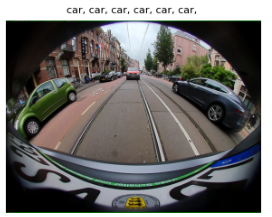

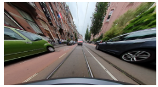

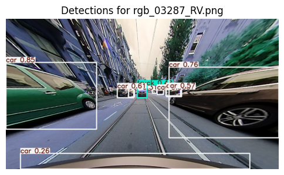

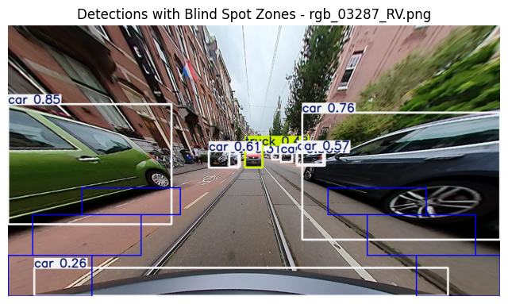

**Lane Collision**

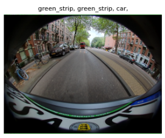

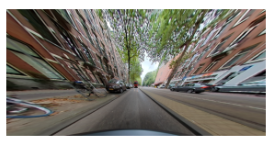

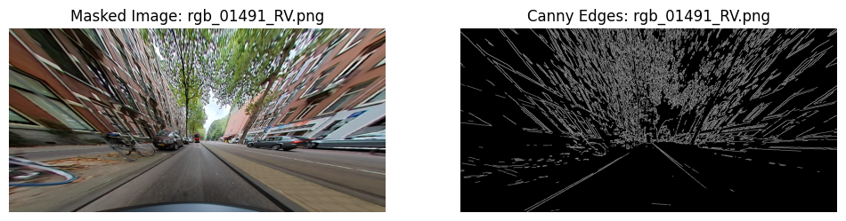

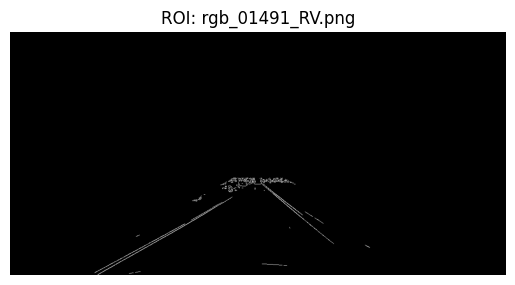

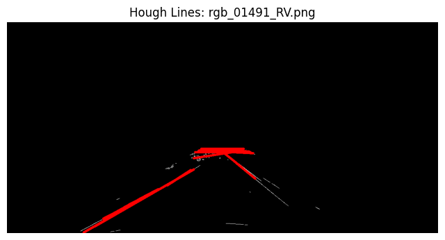

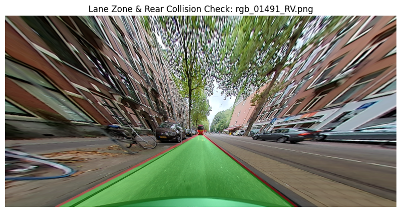

**Lane Departure Warning**
Lane departure warning contains the same steps as collision warning up until EMA, shown below: 

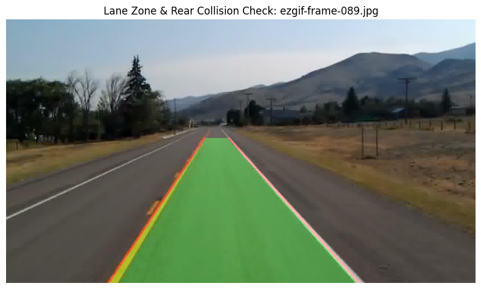

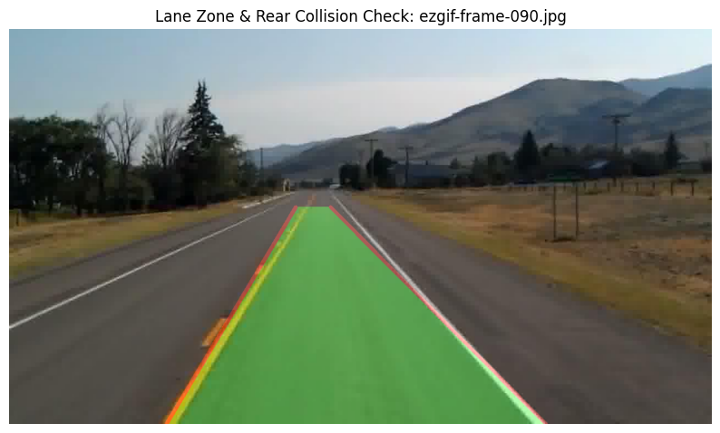

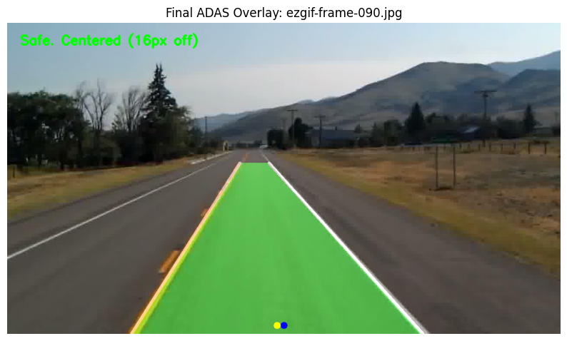

# Final Product

A website has been made that allows the user to test out the systems. By allowing the user to upload images and also to change any parameters they wish. 

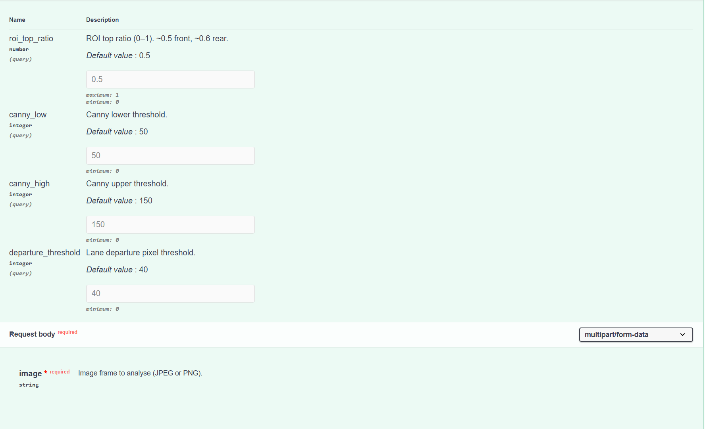

# Conclusions

<!-- Rubric checklist:
       ✓ Rehash of the overall paper / results in context
       ✓ May discuss limitations and "regrets"
       ✓ Reflect on future possible work
-->

The SafeSight project successfully demonstrates that advanced, predictive vehicle safety systems do not inherently require prohibitive hardware investments. By supplanting traditional sensor fusion arrays—such as LiDAR and radar—with a purely vision-based software pipeline, this research establishes the viability of democratized Advanced Driver Assistance Systems (ADAS). Operating entirely on an accessible $180 Raspberry Pi 5 microcomputer, the hybrid architecture successfully merged YOLOv8n deep learning with classical computer vision techniques to maintain a stable localized processing rate of 5–6 FPS. Furthermore, the integration of Exponential Moving Average (EMA) mathematical filters successfully mitigated visual flickering to provide highly stable lane tracking, while standard pinhole camera geometry proved highly effective for monocular depth estimation.

Despite these functional successes, the project's reliance on localized edge computing introduced notable operational constraints. The primary hardware bottleneck of the Raspberry Pi 5 necessitated the deployment of the lightweight "nano" variant of the YOLOv8 architecture, which inherently compromises long-range detection accuracy compared to its larger parameter counterparts. Additionally, relying exclusively on an optical perception pipeline introduces fundamental environmental vulnerabilities; purely monocular systems are highly susceptible to failure under adverse conditions such as heavy rain, fog, or direct solar glare. Retrospectively, while the individual subsystems were rigorously validated in isolated testing environments, a primary regret of this project scope is the absence of a unified, multi-camera physical vehicle rig, which would have facilitated synchronous, real-world testing of the fully integrated pipeline.

Looking forward, future iterations of this framework must prioritize hardware acceleration to achieve true real-time operational standards. Migrating the core perception pipeline to dedicated AI microcomputers, such as the NVIDIA Jetson or Google Coral TPU, would enable the system to easily surpass the 30 FPS real-time threshold. To address the inherent environmental vulnerabilities of optical lenses, future architectures should explore low-cost sensor fusion by integrating affordable millimeter-wave (mmWave) radar modules, ensuring necessary functional redundancy. Furthermore, this project could be transformed a little bit in order to work for motorcycles, as features such as rear end collision warning is really useful for motorists. This is because at red lights or stop signs a motorist is more likely to be rear ended as they are harder to see, especially if the driver is using their phone or preoccupied with something else. Thus, a small system to help them detect rear end collisions could prove to help the motorists to avoid collision or at least give them enough time to properly brace themselves for a collision. 

# References {-}

<!-- This section is auto-populated by Pandoc's --citeproc.     -->
<!-- It reads from the .bib file specified in the YAML header.  -->
<!-- Just leave this heading here and the references appear.    -->

::: {#refs}
:::

<!-- ══════════════════════════════════════════════════════════
     APPENDIX: references.bib example
     ══════════════════════════════════════════════════════════

     Save the following as "references.bib" next to your paper:

     @inproceedings{smith2024,
       author    = {Smith, Alice and Doe, Bob},
       title     = {Convolutional Approaches to Widget Classification},
       booktitle = {Proceedings of the International Conference on
                    Machine Learning (ICML)},
       year      = {2024},
       pages     = {112--120},
     }

     @article{jones2025,
       author  = {Jones, Carol and Lee, Dan},
       title   = {Transformers for Low-Resource Widget Recognition},
       journal = {Journal of Artificial Intelligence Research},
       volume  = {78},
       pages   = {45--67},
       year    = {2025},
       doi     = {10.1234/jair.2025.78.045},
     }

     @misc{tensorflow2024,
       author = {{TensorFlow Team}},
       title  = {TensorFlow: Large-Scale Machine Learning},
       year   = {2024},
       url    = {https://www.tensorflow.org},
     }

     For CSL styles (IEEE, ACM, APA), download from:
       https://github.com/citation-style-language/styles
     and place the .csl file next to your paper.

     ══════════════════════════════════════════════════════════ -->
