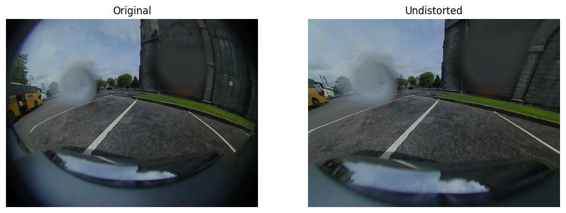

# Journal Report

**Aryan Patel**  
*October 21, 2025*

---

**Research Topic:**   
SafeSight. To create a physical system that can take in images from fisheye cameras, process it, and then using models to check for any dangerous situations. That would mean the system would be have blindspot detection, rear and forward collision warning, lane drift warning, and a screen that could display position of other cars relative to the main car and be the warning system. 

**Mid October Goal:** (What will you have done by 10/15-ish)  
By mid october, two classes, I want to be able to run the yolov8n model on the training data fully without errors and accurately, so then later I can use the bounding boxes and distance for the blindspot detection. 

**October Goal:** (And by 10/30-ish)      
By end of october, I still want to go for my goal with having the blindspot detection to be completed, but not the screen integrated with the blindpsot detection yet. This is because I will be getting a new system to use instead of the Rasperry pi 3, and also because I did not expect it would take me this much time to get this point currenly. 

---

## Daily Log (10/12/25-10/19/25)

**Tuesday October 14**  
I got the undistortion for the fisheye images working. I used openCV to do it and it works pretty well, but there still is some curvature in the images. Though it is pretty minimal I think those curvatures will mess up the YOLO model for future detection,specfically, for lane marking. 

**Friday October 16**  
I was trying to see how I could minimize the error on undistortion method, and I found the calibration file. The file said that the distortion was radial, so I tried making a new method that undistorts with this in mind and it is not working right now. 

---

## Timeline

| Date | Goal | Met? |
|------|------|------|
| Today minus 2 weeks | setup the raspberry pi and download teh data set and model | paused till testing starts |
| This week minus 1 week | Test the yolov8n model and its accuracy and overall speed | Done |
| This week | Get the model fully working | Done |
| Today plus 1 week | Blindspot detction |  TBD|
| Today plus 2 weeks| Finish Blindspot detection (categorizing the possibility for merging)| TBD| 

---

## Reflection

I got the model fully working and had the undisortion method working. Though, later on in the week I tried making a different undistortion method using the info from the calibration file of the dataset and it is not working yet. I accomplished my goal for this week, and I still think that finishing blindspot detection in the next two weeks is possible, with the two main hurdles being calculating distance and making it work with video feedback. 

Image after undistortion with openCV it works pretty well, but there is still some slight curvature. 