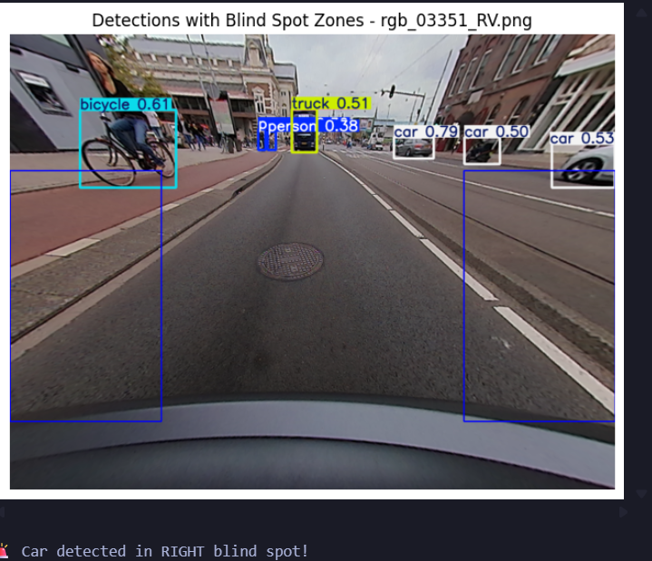
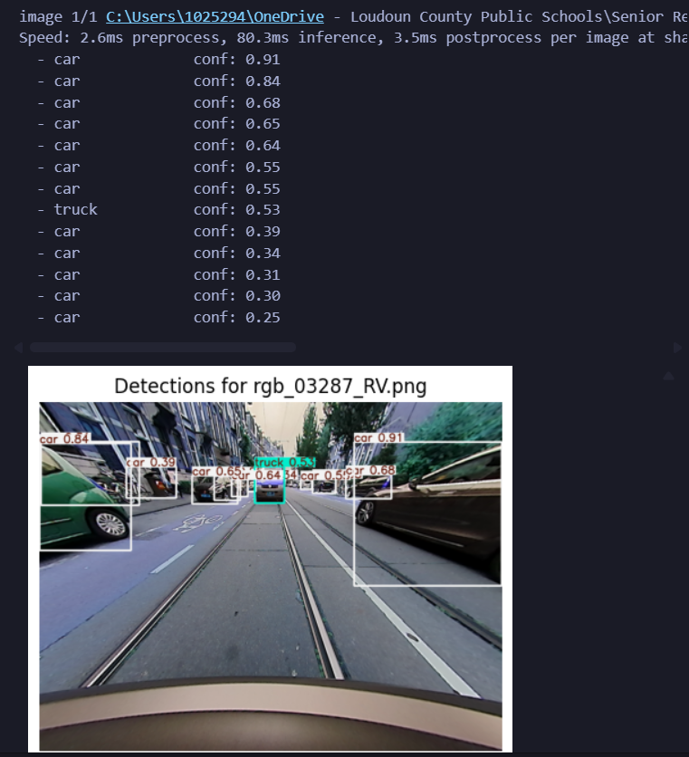

Things to Keep in mind
-
**More info in: Rearview Camera-Based Blind-Spot Detection and Lane Change Assistance System for Autonomous Vehicles**
-   For fisheye rear view cameras: 

-   The vehicle moving up and down can cause vibrations that can impede object detection
    - A method to adjust for this is to find the vanishing point:
    - "The proposed method imposes a limitation of a maximum movement of ±30 pixels to exclude exceptional situations, such as speed bumps, where the vanishing point moves significantly.  Sd = Oy − Vy  where Oy represents the vanishing point coordinate measured when the vehicle is stationary and Vy denotes the modified vanishing point coordinate. Sd represents the difference in distance moved."
     
- To detect objects far away with less pixels, use the ROI method which takes the top section of the image and resizes it to: 
 
- Kalman filter for object tracking, minimial computational overheas
- 